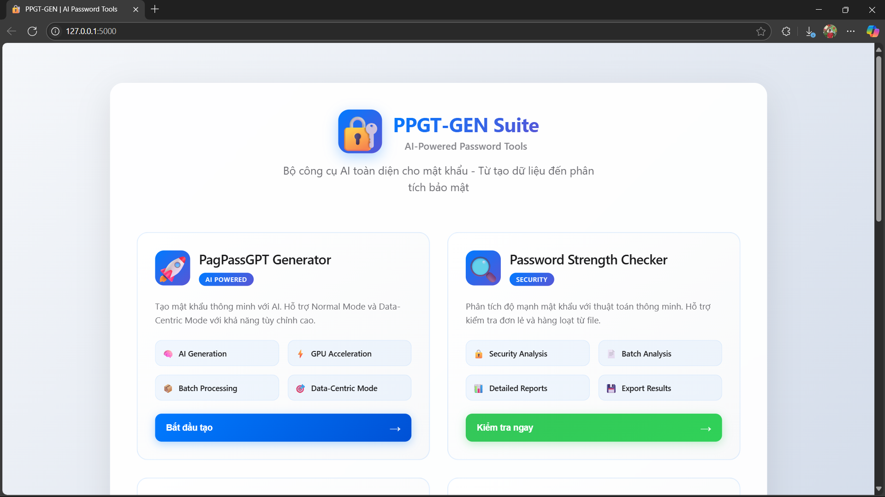

# PPGT-GEN

## Introduction

PPGT-GEN is a convenient local web application for using the PahPassGPT model, replacing the complex Command Line Interface (CLI) usage. The application provides a user-friendly interface for:

- **Password Generation**: Using PahPassGPT model to generate intelligent passwords
- **Password Strength Checking**: Analyzing and evaluating password security
- **Entropy Analysis**: Measuring randomness and unpredictability of passwords
- **Pattern Checking**: Detecting patterns and rules in passwords
- **Model Evaluation**: Comparing effectiveness of different models

<p align="center">
  
  
</p>

<p align="center">
  
  
</p>


## System Requirements

- Python 3.8+
- Flask
- PyTorch
- Transformers
- Other dependencies (see `requirements.txt`)

## Installation

### 1. Clone repository

```bash
git clone https://github.com/WanThinnn/PPGT-GEN.git
cd PPGT-GEN
```

### 2. Install dependencies

```bash
pip install -r requirements.txt
```

### 3. Prepare Model and Dataset

#### Get Original Model and Dataset

To obtain the model and dataset for training, please refer to the original project:

**[PagPassGPT Original Repository](https://github.com/Suxyuuu/PagPassGPT.git)**

#### Setup Dataset

1. Download the preprocessed RockYou dataset from the original project
2. Copy the entire dataset to the directory:
   ```
   PPGT-GEN/dataset/
   ```
   Dataset directory structure:
   ```
   dataset/
   ├── rockyou-cleaned.txt
   └── [other dataset files]
   ```

#### Setup Model

1. After training the model from the original project, you will have a `last-step` directory
2. Copy the entire `last-step` directory to:
   ```
   PPGT-GEN/model/last-step/
   ```
   Model directory structure:
   ```
   model/
   └── last-step/
       ├── config.json
       ├── generation_config.json
       ├── optimizer.pt
       ├── pytorch_model.bin
       ├── rng_state.pth
       ├── scheduler.pt
       ├── trainer_state.json
       └── training_args.bin
   ```

## Usage

### Launch the application

```bash
python app.py
```

The application will run at: `http://localhost:5000`

### Main Features

#### 1. PPGT Generator
- **Path**: `/ppgt_gen`
- **Function**: Generate passwords using PahPassGPT model
- **Options**: Configure length, patterns, and password generation parameters

#### 2. Password Strength Checker
- **Path**: `/strength_checker`
- **Function**: Check and evaluate password strength
- **Features**: Detailed analysis of security factors

#### 3. Password Entropy Checker
- **Path**: `/entropy_checker`
- **Function**: Analyze password entropy (randomness)
- **Features**: Measure unpredictability

#### 4. Password Pattern Checker
- **Path**: `/pattern_checker`
- **Function**: Detect and analyze patterns in passwords
- **Features**: Identify common rules and patterns

#### 5. Password Evaluate Checker
- **Path**: `/evaluate_checker`
- **Function**: Evaluate and compare model effectiveness
- **Features**: Statistics and analysis charts

## Project Structure

```
PPGT-GEN/
├── app.py                      # Main Flask application
├── requirements.txt            # Dependencies
├── README.md                   # This documentation
├── patterns.txt               # Pattern files
├── app.log                    # Log file
├── dataset/                   # Dataset directory
│   └── rockyou-cleaned.txt
├── model/                     # Model directory
│   └── last-step/
├── libanalyst/               # Analysis library
│   ├── password_strength_checker.py
│   ├── password_entropy_checker.py
│   ├── password_pattern_checker.py
│   └── password_evaluate_checker.py
├── libppgt/                  # PPGT core library
│   ├── __init__.py
│   ├── concat_pattern_password.py
│   ├── DC-GEN.py
│   ├── get_pattern_rate.py
│   ├── normal-gen.py
│   └── tokenizer/
├── templates/                # HTML templates
│   ├── index.html
│   ├── ppgt_gen.html
│   ├── strength_checker.html
│   ├── entropy_checker.html
│   ├── pattern_checker.html
│   └── evaluate_checker.html
└── static/                   # CSS & JS files
    ├── css/
    └── js/
```

## API Endpoints

### Core Endpoints
- `GET /` - Main page
- `GET /ppgt_gen` - Password Generator
- `GET /strength_checker` - Strength Checker
- `GET /entropy_checker` - Entropy Checker
- `GET /pattern_checker` - Pattern Checker
- `GET /evaluate_checker` - Evaluate Checker

### API Endpoints
- `POST /api/generate_password` - Generate passwords
- `POST /api/check_strength` - Check strength
- `POST /api/analyze_entropy` - Analyze entropy
- `POST /api/check_pattern` - Check patterns
- `POST /api/evaluate_model` - Evaluate model


## Collaborator

- **Lại Quan Thiên** - [WanThinnn](https://github.com/WanThinnn)
- **Mai Nguyễn Nam Phương** - [Mai Nguyen Nam Phuong - Cyber Security](https://github.com/namphuong11)
- **Trần Thế Hữu Phúc** - [tranthehuuphuc](https://github.com/tranthehuuphuc)
- **Hồ Diệp Huy** - [hohuyy](https://github.com/hohuyy)
  

## Contact & Support

- **Original Project**: [PagPassGPT](https://github.com/Suxyuuu/PagPassGPT.git)
- **Issues**: Create an issue on this GitHub repository
- **Documentation**: See additional documentation in the docs/ folder

## Acknowledgments

- Thanks to the [PagPassGPT](https://github.com/Suxyuuu/PagPassGPT.git) development team for the original model and dataset
- Thanks to the open source community for contributions and support

---

**Security Note**: Only use this application in a local environment and do not share the model or dataset externally without proper permissions.